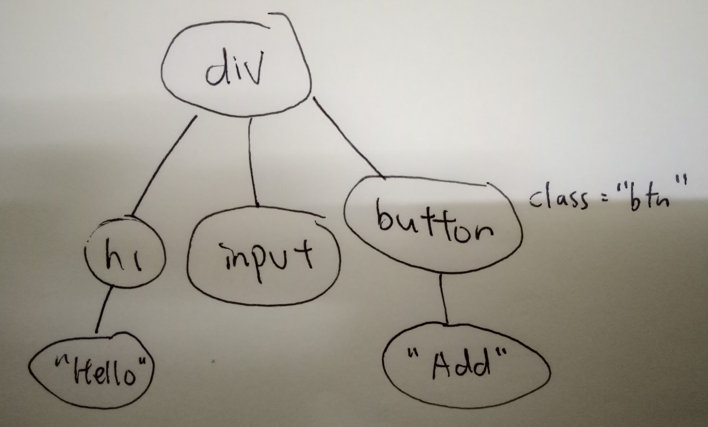

# React: JS Library to build UI

## UI = fn(data)

- Everytime data change, you generate the desired view (actually, the data structure that represents the view) that you want to have with that data
- The desired view is provided to React, and React will compare with previous view and find the difference between them and do the minimal operation on DOM
