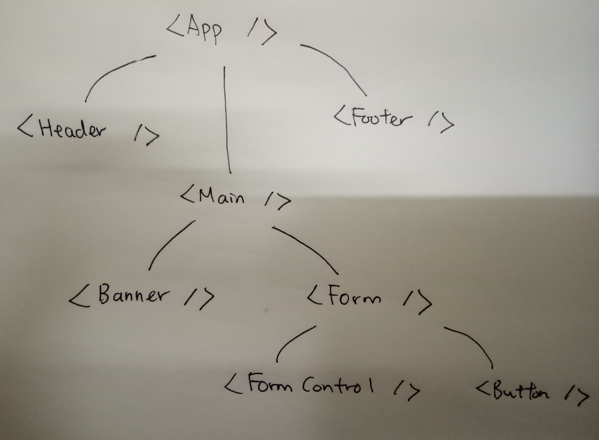

# Building Blocks of React Application

## React Component

A React component is a function that returns React element, i.e. the data structure that represents DOM.

React component must be a pure function.

- given same props, it always produce same result
- it doesn't have side effect like updating DOM or changing the props

React components are composable.

- A React components can contain another React components, just like a function can call another function.

## React Hooks

If React always returns same result given same input, then

- how can React component has state?
- how to invoke side-effect like listen to dom event in React component?

React hooks are how you used to achieve those.

- useState hook allow a React component to have state that it can keep track of.
- useEffect hook allows a React component to make side effects
