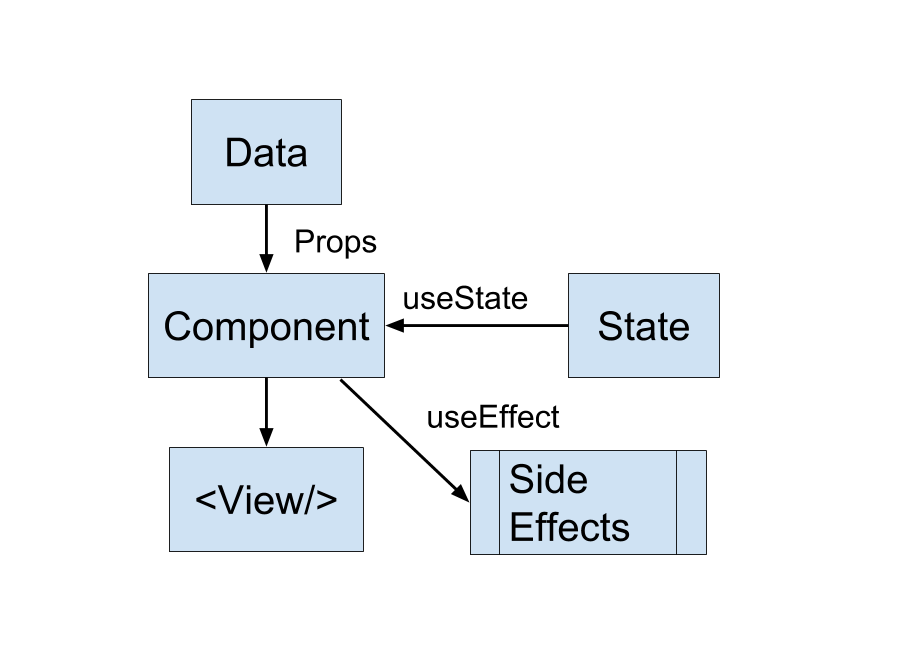

## More on React Hooks

- React hooks is like mixin/decorator, but more powerful.
- Hooks behavior could change based on runtime value.
- useState hook is another sources (in addition of props) that could cause our App to rerender.
- useEffect hooks is another "output" of our component in addition of the DOM.

- What is great about React hook is that they are composable just like React components.
